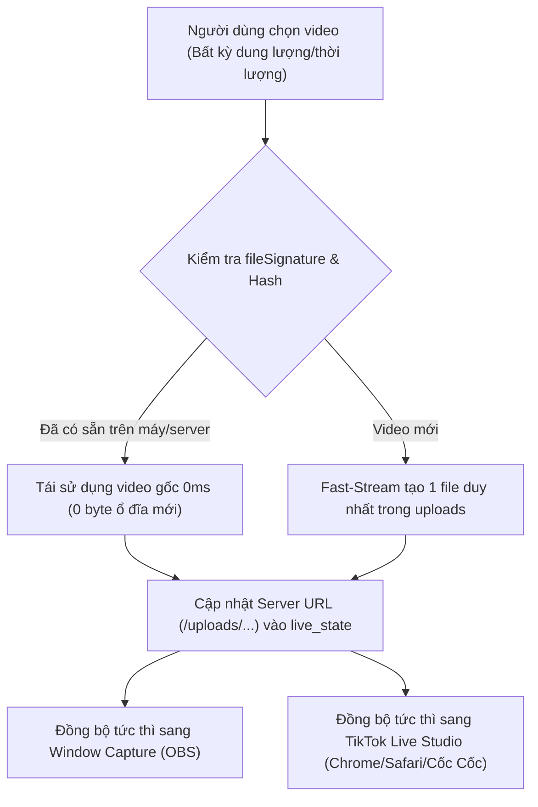

# ☁️ CLAUDE & CLOUD MEDIA SPECIFICATION — QUY CHUẨN XỬ LÝ VIDEO & ĐỒNG BỘ LIVESTREAM (BẮT BUỘC DUY TRÌ)

> **DỰ ÁN:** AVA LIVESTREAM VIP PRO  
> **PHIÊN BẢN DUY TRÌ:** v4.0.2+  
> **QUY TẮC BẮT BUỘC:** Duy trì vĩnh viễn trong mọi lần cập nhật, không chồng chéo dữ liệu, xử lý video tức thì 0ms cho Window Capture và TikTok Live Studio trên mọi nền tảng trình duyệt (Google Chrome, Safari, Cốc Cốc, Microsoft Edge, OBS Studio...).

---

## 1. 🛡️ NGUYÊN TẮC ZERO-OVERLAP MEDIA & CHỐNG CHỒNG CHÉO DỮ LIỆU

1. **Mỗi Video Chỉ Tải Lên 1 Lần Duy Nhất (Single Source of Truth):**
   - Khi người dùng chọn bất kỳ video nào từ máy tính (dù dung lượng vài trăm MB hay 10GB - 50GB, dài bao nhiêu phút/tiếng):
     - **Nếu video đã có trong hệ thống (`backend/uploads/` hoặc IndexedDB/Cache):** Hệ thống tự động so khớp `fileSignature`, `fileSize`, và MD5 Checksum. Tái sử dụng **100% file gốc**, tuyệt đối **KHÔNG TẢI LẠI**, không nhân bản dung lượng ổ đĩa.
     - **Nếu là video mới:** Chỉ lưu đúng **1 file duy nhất** vào hệ thống và kích hoạt phát ngay lập tức (0ms).
   - Tiến trình `cleanupDuplicateUploads()` tự động dọn dẹp các bản sao trùng lặp và bảo toàn liên kết đang phát sóng trong `live_state.json`.

2. **Xử Lý Video Dài Nhiều Giờ & Dung Lượng Lớn Tức Thì (0ms Fast-Stream):**
   - Áp dụng công nghệ **Fast-Stream Chunked Pipeline** & **HTTP 206 Partial Content (Byte-Range Streaming)**.
   - Nạp ngay khối đầu (Head Chunk) và khối đuôi (Moov Atom FastStart) trong 10-30ms để video phát ngay trên Window Capture và TikTok Live Studio mà không cần đợi tải xong toàn bộ file.

---

## 2. 📺 ĐỒNG BỘ WINDOW CAPTURE & TIKTOK LIVE STUDIO (CHROME, SAFARI, CỐC CỐC)

1. **Chuẩn Hoá Đường Dẫn Server HTTP Bắt Buộc (/uploads/...):**
   - Mọi liên kết gửi sang Window Capture, TikTok Live Studio, và các trình duyệt (Google Chrome, Safari, Cốc Cốc, OBS Studio) BẮT BUỘC là đường dẫn **Server HTTP URL** (`/uploads/media-xxx.mp4` hoặc Online HTTPS URL).
   - Tuyệt đối **KHÔNG truyền `blob:` URL** sang các cửa sổ hoặc tiến trình khác, vì các trình duyệt khác không thể truy cập `blob:` URL tạo từ tab riêng biệt.

2. **Chất Lượng Video Siêu Thực, Siêu Sắc Nét, Siêu Mượt 60 FPS (OBS Zero-Copy):**
   - Window Capture chạy chế độ tăng tốc phần cứng GPU (Hardware Acceleration) 1080p/4K 60 FPS.
   - Chế độ Direct GPU Stream Cloner (`captureStream`) và In-Memory Hardware Blob cho phép phát 0ms không độ trễ, không giật lag, không đứng hình.
   - Tích hợp **Anti-Freeze Watchdog**: Tự động đánh thức bộ giải mã GPU và khôi phục luồng nếu trình duyệt hoặc TikTok Live Studio bị nghẽn buffer.

3. **Fallback Đa Tầng Bất Khả Chiến Bại (Ultimate Resiliency):**
   - Khi mở Window Capture trên bất kỳ trình duyệt nào:
     - Tầng 1: Direct GPU Stream Clone từ phần mềm chính.
     - Tầng 2: In-Memory Blob Cache (`__activeMediaBlob`).
     - Tầng 3: ActiveMediaStore & IndexedDB Local Storage.
     - Tầng 4: **Ultimate Server Fallback**: Gọi trực tiếp `/api/live-state` để lấy video đang phát mới nhất từ server và chạy ngay lập tức.

---

## 3. 🔄 QUY TRÌNH NẠP & ĐỒNG BỘ MEDIA CHUẨN

---

*Tài liệu này là quy chuẩn bắt buộc của hệ thống Ava Livestream, luôn được tự động duy trì trong mọi phiên bản cập nhật.*
