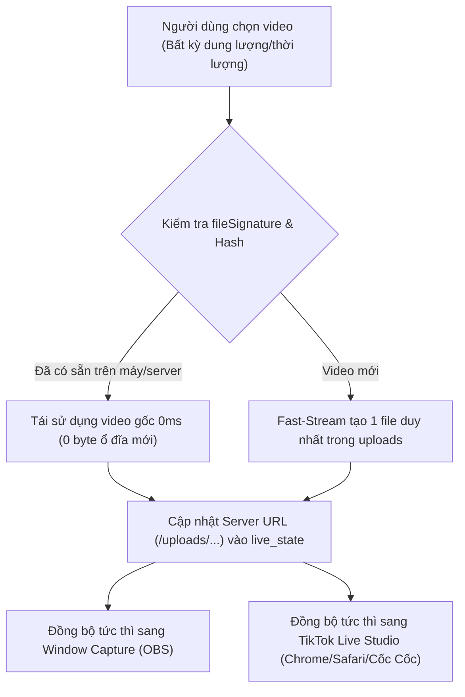
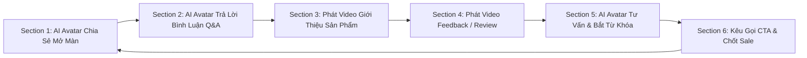

# ☁️ CLAUDE & CLOUD MEDIA SPECIFICATION — QUY CHUẨN XỬ LÝ VIDEO & ĐỒNG BỘ LIVESTREAM (BẮT BUỘC DUY TRÌ)

> **DỰ ÁN:** AVA LIVESTREAM VIP PRO  
> **PHIÊN BẢN DUY TRÌ:** v4.2.5+  
> **QUY TẮC BẮT BUỘC:** Duy trì vĩnh viễn trong mọi lần cập nhật, không chồng chéo dữ liệu, xử lý video tức thì 0ms cho Window Capture và TikTok Live Studio trên mọi nền tảng trình duyệt (Google Chrome, Safari, Cốc Cốc, Microsoft Edge, OBS Studio...).
> **QUY TẮC KHÓA CHẶT (STRICT TAB & SUBVIEW LOCK):** Toàn bộ các tab chức năng, subview và module không được yêu cầu đều được khóa chặt 100%. Chỉ kích hoạt lệnh và tương tác chính xác với subview/tab mục tiêu khi người dùng yêu cầu, không có bất kỳ lệnh ngoài luồng nào tác động chéo.

---

## 1. 🛡️ NGUYÊN TẮC ZERO-OVERLAP MEDIA & CHỐNG CHỒNG CHÉO DỮ LIỆU

1. **Mỗi Video Chỉ Tải Lên 1 Lần Duy Nhất (Single Source of Truth):**
   - Khi người dùng chọn bất kỳ video nào từ máy tính (dù dung lượng vài trăm MB hay 10GB - 50GB, dài bao nhiêu phút/tiếng):
     - **Nếu video đã có trong hệ thống (`backend/uploads/` hoặc IndexedDB/Cache):** Hệ thống tự động so khớp `fileSignature`, `fileSize`, và MD5 Checksum. Tái sử dụng **100% file gốc**, tuyệt đối **KHÔNG TẢI LẠI**, không nhân bản dung lượng ổ đĩa.
     - **Nếu là video mới:** Chỉ lưu đúng **1 file duy nhất** vào hệ thống và kích hoạt phát ngay lập tức (0ms).
   - Tiến trình `cleanupDuplicateUploads()` tự động dọn dẹp các bản sao trùng lặp và bảo toàn liên kết đang phát sóng trong `live_state.json`.

2. **Xử Lý Video Dài Nhiều Giờ & Dung Lượng Lớn Tức Thì (0ms Fast-Stream):**
   - Áp dụng công nghệ **Fast-Stream Chunked Pipeline** & **HTTP 206 Partial Content (Byte-Range Streaming)**.
   - Nạp ngay khối đầu (Head Chunk) và khối đuôi (Moov Atom FastStart) trong 10-30ms để video phát ngay trên Window Capture và TikTok Live Studio mà không cần đợi tải xong toàn bộ file.

---

## 2. 📺 ĐỒNG BỘ WINDOW CAPTURE & TIKTOK LIVE STUDIO (CHROME, SAFARI, CỐC CỐC)

1. **Chuẩn Hoá Đường Dẫn Server HTTP Bắt Buộc (/uploads/...):**
   - Mọi liên kết gửi sang Window Capture, TikTok Live Studio, và các trình duyệt (Google Chrome, Safari, Cốc Cốc, OBS Studio) BẮT BUỘC là đường dẫn **Server HTTP URL** (`/uploads/media-xxx.mp4` hoặc Online HTTPS URL).
   - Tuyệt đối **KHÔNG truyền `blob:` URL** sang các cửa sổ hoặc tiến trình khác, vì các trình duyệt khác không thể truy cập `blob:` URL tạo từ tab riêng biệt.

2. **Chất Lượng Video Siêu Thực, Siêu Sắc Nét, Siêu Mượt 60 FPS (OBS Zero-Copy):**
   - Window Capture chạy chế độ tăng tốc phần cứng GPU (Hardware Acceleration) 1080p/4K 60 FPS.
   - Chế độ Direct GPU Stream Cloner (`captureStream`) và In-Memory Hardware Blob cho phép phát 0ms không độ trễ, không giật lag, không đứng hình.
   - Tích hợp **Anti-Freeze Watchdog**: Tự động đánh thức bộ giải mã GPU và khôi phục luồng nếu trình duyệt hoặc TikTok Live Studio bị nghẽn buffer.

3. **Fallback Đa Tầng Bất Khả Chiến Bại (Ultimate Resiliency):**
   - Khi mở Window Capture trên bất kỳ trình duyệt nào:
     - Tầng 1: Direct GPU Stream Clone từ phần mềm chính.
     - Tầng 2: In-Memory Blob Cache (`__activeMediaBlob`).
     - Tầng 3: ActiveMediaStore & IndexedDB Local Storage.
     - Tầng 4: **Ultimate Server Fallback**: Gọi trực tiếp `/api/live-state` để lấy video đang phát mới nhất từ server và chạy ngay lập tức.

---

## 3. 🔄 QUY TRÌNH NẠP & ĐỒNG BỘ MEDIA CHUẨN

---

## 4. 🎬 QUY CHUẨN THIẾT LẬP CHUỖI KỊCH BẢN LIVESTREAM TỰ ĐỘNG ĐA PHÂN ĐOẠN (AUTOMATED MULTI-SECTION FLOW SEQUENCER)

### 1. Kiến Trúc Luồng Vận Hành Phiên Live Hoàn Chỉnh (6-Step Cycle):
Hệ thống kết hợp các module hiện có (`AIAvatarStudio.jsx`, `WorkspaceTacVu.jsx`, `WorkspaceKeywordPanel.jsx`, `LiveCommerceStudio.jsx`) thành chuỗi phân đoạn tự động liên tiếp:

### 2. Chi Tiết Từng Phân Đoạn (Sections) & Cấu Hình Thời Gian:
- **Section 1 — AI Avatar Mở Màn & Chia Sẻ Kiến Thức (2 - 3 phút):**
  - *Module phụ trách:* `WorkspaceTacVu` -> *Mục "Kịch bản Idol"* (`script_broadcast`).
  - *Cơ chế:* AI đọc kịch bản giới thiệu theo thời gian định trước. Avatar nhép miệng tự động theo giọng đọc AI sinh ra.
- **Section 2 — Tự Động Trả Lời Bình Luận TikTok Live (3 - 5 phút hoặc ngắt khi hết câu hỏi):**
  - *Module phụ trách:* `WorkspaceTacVu` -> *Mục "Bình luận"* (`comment`) & *Bộ Não Voice AI*.
  - *Cơ chế linh hoạt:*
    - Khi có bình luận từ TikTok Live Studio: AI trích xuất câu hỏi -> tạo câu trả lời tức thì.
    - Người dùng có thể chọn: Trả lời bằng **Voice AI + Video Avatar Lip-sync** (khi muốn Avatar xuất hiện nói trực tiếp), hoặc chỉ phát **Voice AI nền** (khi đang phát slide/video nền).
- **Section 3 — Trình Chiếu Video Giới Thiệu Sản Phẩm (Setup theo thời lượng video: ví dụ 60s - 120s):**
  - *Module phụ trách:* `WorkspaceTacVu` -> *Mục "Chốt đơn"* (`checkout`) / Thư viện Media.
  - *Cơ chế:* Khi hết thời gian Section 2, hệ thống tự động chuyển luồng phát sang Video Sản phẩm tương ứng. Video chạy hết thời lượng (hoặc hết thời gian đặt trước) sẽ tự động trigger sang Section tiếp theo.
- **Section 4 — Trình Chiếu Video Feedback / Trải Nghiệm Khách Hàng (30s - 60s):**
  - *Module phụ trách:* `WorkspaceTacVu` / `WorkspaceKeywordPanel` (Media Trigger).
  - *Cơ chế:* Phát các video review thực tế để gia tăng độ tin cậy và kích thích quyết định mua hàng.
- **Section 5 — AI Avatar Tư Vấn Chuyên Sâu & Bắt Từ Khóa Giỏ Hàng (2 - 3 phút):**
  - *Module phụ trách:* `WorkspaceKeywordPanel` (Auto-Pin & Keyword Trigger).
  - *Cơ chế:* Khi khán giả bình luận các từ khóa như *"giá", "mua", "màu sắc", "ưu đãi"*, hệ thống tự động ghim sản phẩm lên màn hình và kích hoạt AI Avatar tư vấn cụ thể về sản phẩm đó.
- **Section 6 — Kêu Gọi Hành Động (CTA) & Đếm Ngược Chốt Sale (1 - 2 phút):**
  - *Module phụ trách:* `WorkspaceTacVu` -> *Mục "Kêu gọi tương tác"* (`call_to_action`).
  - *Cơ chế:* AI đọc lời kêu gọi cấp bách: *"Khách yêu nhấn vào giỏ hàng góc trái màn hình ngay nhé, số lượng có hạn..."*.
- **Vòng Lặp Tuần Hoàn Tự Động (Auto-Loop Endless Stream):**
  - Sau khi hoàn thành Section 6, chuỗi tự động quay lại Section 1 với sản phẩm tiếp theo, vận hành 24/7 không cần can thiệp thủ công.

### 3. Hướng Dẫn Thao Tác Cài Đặt Dành Cho Người Dùng:
1. **Bước 1 — Chọn Nhân Vật Avatar & Giọng Đọc:** Tại tab *AIAvatarStudio*, chọn Avatar mong muốn và chọn giọng đọc AI yêu thích.
2. **Bước 2 — Cài Đặt Kịch Bản & Thời Gian Phân Đoạn:** Tại *Workspace Tác Vụ*, nhập nội dung kịch bản cho từng phần hoặc bấm **"Nạp File"** để tải file kịch bản có sẵn.
3. **Bước 3 — Nạp Video Sản Phẩm & Video Feedback:** Trong mục *Chốt đơn / Từ khóa*, chọn video cho từng sản phẩm và nhập thời gian phát (số giây/phút mong muốn).
4. **Bước 4 — Bật Kết Nối TikTok Live Studio:** Lấy link Online HTTPS (`/live-stream`) dán vào TikTok Live Studio. Hệ thống sẽ tự động điều phối toàn bộ chuỗi sự kiện và phản hồi mượt mà 60 FPS 4K.

---

*Tài liệu này là quy chuẩn bắt buộc của hệ thống Ava Livestream, luôn được tự động duy trì trong mọi phiên bản cập nhật.*
