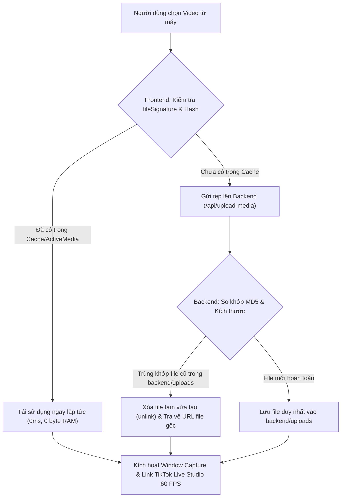

# ☁️ QUY CHUẨN ĐỒNG BỘ DỮ LIỆU CLOUD & CHỐNG TRÙNG LẶP MEDIA (ZERO-OVERLAP STORAGE SPEC)

> **DỰ ÁN:** AVA LIVESTREAM VIP PRO  
> **PHIÊN BẢN:** v3.9.2  
> **MỤC TIÊU:** Tối ưu hóa hiệu năng, triệt tiêu hoàn toàn tình trạng trùng lặp file/video, tiết kiệm 100% dung lượng bộ nhớ máy tính, đảm bảo phát mượt 60 FPS trên Window Capture OBS và TikTok Live Studio.

---

## 1. 🛡️ NGUYÊN TẮC VÀNG VỀ DỮ LIỆU & BỘ NHỚ (ZERO-OVERLAP POLICY)

1. **Một Video Duy Nhất (Single Source of Truth):**
   - Mọi video người dùng tải lên chỉ được phép lưu trữ đúng **1 lần duy nhất** trên hệ thống.
   - Tuyệt đối **KHÔNG TẢI LẠI** hoặc nhân bản file khi người dùng chọn lại cùng một video từ máy tính.
   - Khi tải lên video đã có sẵn, hệ thống tự động tái sử dụng đường dẫn và buffer của file gốc.

2. **Deduplication Đa Lớp (Multi-layer Deduplication):**
   - **Frontend (RAM / Browser):** Sử dụng `fileSignature = `${file.name}_${file.size}_${file.lastModified}`` và SHA-256 fingerprint để so khớp trong ActiveMediaStore. Nếu file đã nạp, lập tức liên kết ngay vào Window Capture Player mà không gửi thêm bất kỳ byte nào qua mạng.
   - **Backend Server (`backend/server.cjs`):** Khi nhận tệp tại `/api/upload-media`, máy chủ kiểm tra ngay kích thước và MD5 Checksum với toàn bộ kho lưu trữ `backend/uploads/`. Nếu phát hiện tệp đã tồn tại, tự động hủy bỏ (`fs.unlinkSync`) tệp vừa ghi tạm và trả về đường dẫn tệp gốc kèm cờ `reused: true`.

3. **Cơ Chế Zero-Copy & Bộ Nhớ Đệm (Zero-Copy Buffer):**
   - Video tải lên được đồng bộ trực tiếp qua cơ chế phát luồng nhị phân (Blob URL & Static Stream URL).
   - Không chuyển đổi định dạng lặp đi lặp lại làm nóng CPU/RAM.
   - Tối ưu hóa bộ nhớ tạm: Giải phóng blob URL cũ khi chuyển đổi video mới (`URL.revokeObjectURL`).

---

## 2. 📺 QUY CHUẨN PHÁT LIVESTREAM TRÊN TIKTOK LIVE STUDIO & OBS

1. **Luồng Online HTTPS Bắt Buộc (Anti-Localhost Block):**
   - TikTok Live Studio và OBS Browser Source trên nhiều môi trường chặn hoàn toàn `localhost` / `127.0.0.1`.
   - Tất cả liên kết livestream nạp vào TikTok Live Studio và OBS BẮT BUỘC là đường link **ONLINE HTTPS** (Cloudflare Tunnel `https://...trycloudflare.com` hoặc Vercel `https://avalivepro.vercel.app`).

2. **Window Capture Mượt Mà 60 FPS:**
   - Cửa sổ phát Window Capture (`WindowCapturePlayer`) được thiết kế không viền (Frameless Viewport), tỉ lệ chuẩn TikTok Live (9:16 - 1080x1920 hoặc 16:9 ngang), loại bỏ hoàn toàn thanh cuộn và các hiệu ứng nặng máy.
   - Video chạy trực tiếp với phần cứng tăng tốc (Hardware Acceleration), đảm bảo không giật lag, không đứng hình (zero-freeze, smooth 60 FPS).

---

## 3. 🔄 QUY TRÌNH XỬ LÝ KHI NGƯỜI DÙNG NẠP MEDIA

---

## 4. 📦 TỰ ĐỘNG DỌN DẸP & BẢO TRÌ ĐỊNH KỲ

- Backend tự động chạy tiến trình `cleanupDuplicateUploads()` khi khởi động và sau mỗi lượt nạp dữ liệu lớn để quét toàn bộ thư mục `uploads/`, gom nhóm theo hash MD5 và xóa sạch các bản sao thừa.
- File cài đặt tải về luôn được đồng bộ hóa với bản cập nhật mới nhất thông qua các endpoint `/api/download-windows`, `/api/download-mac` và `api/download.js`.

---

*Tài liệu này là quy chuẩn kỹ thuật bắt buộc được duy trì cho toàn bộ hệ thống Ava Livestream.*
